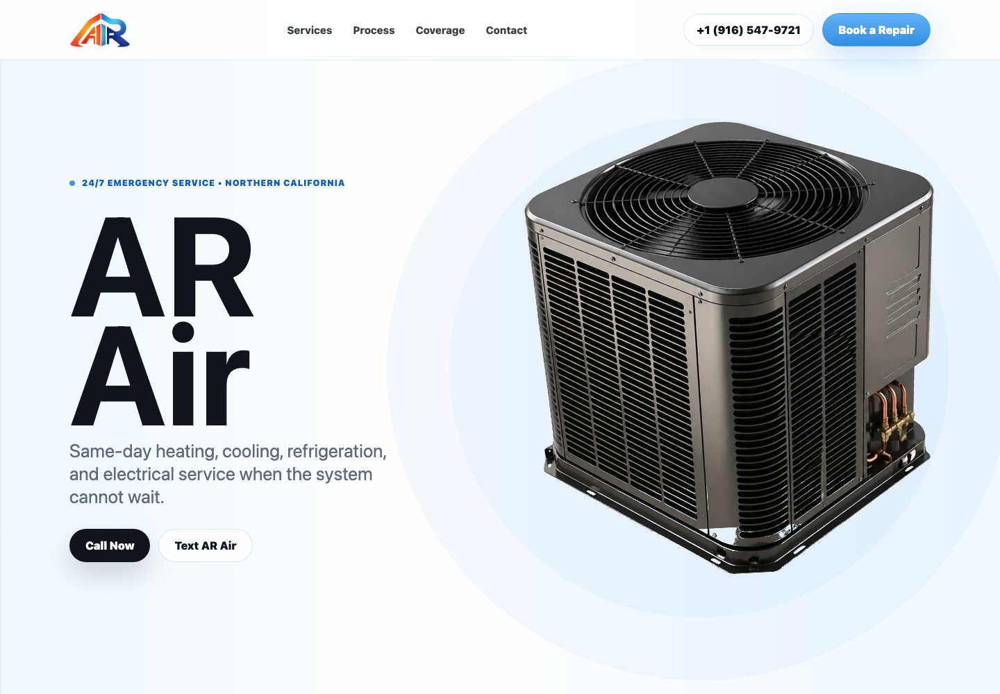
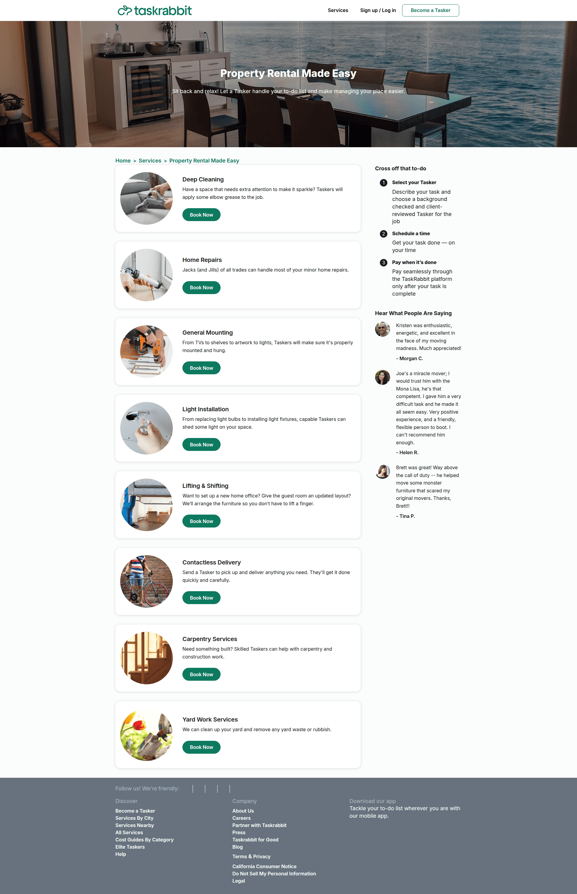
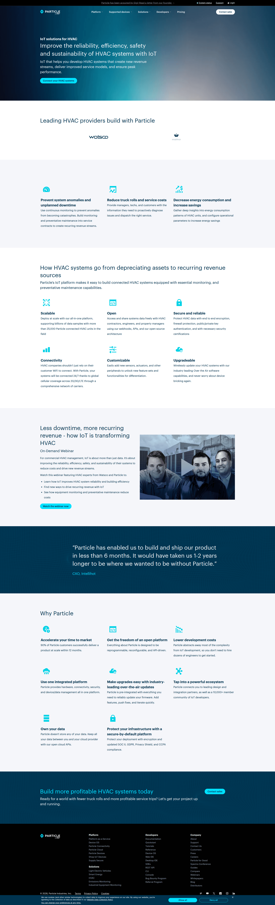
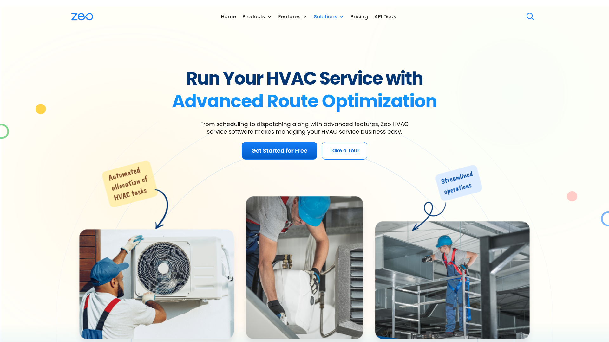
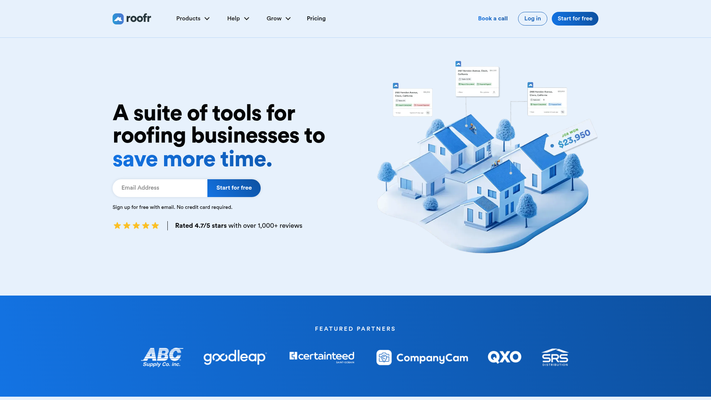

# AR Air Homepage Improvements

## TL;DR
The current page is over-indexed on showpiece animation and equipment collage. The redesign should remove the confusing assembly section, make one AC unit the product hero, and make the conversion path impossible to miss: call, text, or request quote.

## Current State

The current hero uses the right color family, but hierarchy and motion compete with the service message.

## Improvement Moves
- Keep the blue-white palette, but use more white space and thinner blue rules instead of heavy blue backgrounds.
- Use one hero equipment image only. No extra furnace/object behind it, no fake floor shadow, no split-part animation in the hero.
- Put phone, text, and quote as the first three actions above the fold.
- Replace the large scroll assembly with compact service rows and a proof band.
- Use service-area and emergency trust content before asking for the form.

## Lazyweb References
### 1. taskrabbit

Marketplace services landing page for property rental and home management, showing a list of task categories (deep cleaning, home repairs, mounting, light installation, lifting/shifting, delivery, carpentry, yard work) with images and “Book Now” CTA buttons. A right sidebar explains the booking flow (select a tasker, schedule, pay when complete) and includes customer testimonials, with top navigation for services and sign up/log in.

Source: https://www.taskrabbit.com/services/property-rentals

### 2. particle

Marketing landing page for an IoT platform focused on HVAC, featuring a hero headline about improving reliability, efficiency, and safety with a primary “Contact your HVAC experts” CTA plus top navigation (Platform, Supported devices, Solutions, Developers, Pricing) and a “Contact sales” button. The page highlights benefits and features in icon-based sections (prevent anomalies, reduce truck rolls, lower energy use, scalable/open/customizable/secure), includes an on-demand webinar promo, customer testimonial, “Why Particle” value props, and a bottom CTA to “Build more profitable HVAC systems today.

Source: https://www.particle.io/iot-solutions/hvac/

### 3. zeo-route-planner

Landing page for ZEO HVAC service management software promoting advanced route optimization from scheduling to dispatching, featuring illustrative images of technicians installing AC units and working on ducts, highlighted sticky notes for "Scheduling" and "Dispatching," and a prominent "Get Started Free" call-to-action button.

Source: https://zeorouteplanner.com/hvac-software/

### 4. roofr

Landing page for Roof. ai, a SaaS platform offering a suite of time-saving tools for roofing businesses including invoicing and productivity features, with prominent navigation for Products, Tools, and Pricing, a "Sign up for free" call-to-action, illustrative 3D houses and notes graphics, and a section showcasing featured partners like ABC, Goodloop, and SRS.

Source: https://roofr.com/

## Reference Index
- 1. [taskrabbit](https://www.taskrabbit.com/services/property-rentals) - Marketplace services landing page for property rental and home management, showing a list of task categories (deep cleaning, home repairs, mounting, light installation, lifting/shifting, delivery, carpentry, yard work) with images and “Book Now” CTA buttons. A right sidebar explains the booking flow (select a tasker, schedule, pay when complete) and includes customer testimonials, with top navigation for services and sign up/log in.
- 2. [particle](https://www.particle.io/iot-solutions/hvac/) - Marketing landing page for an IoT platform focused on HVAC, featuring a hero headline about improving reliability, efficiency, and safety with a primary “Contact your HVAC experts” CTA plus top navigation (Platform, Supported devices, Solutions, Developers, Pricing) and a “Contact sales” button. The page highlights benefits and features in icon-based sections (prevent anomalies, reduce truck rolls, lower energy use, scalable/open/customizable/secure), includes an on-demand webinar promo, customer testimonial, “Why Particle” value props, and a bottom CTA to “Build more profitable HVAC systems today.
- 3. [zeo-route-planner](https://zeorouteplanner.com/hvac-software/) - Landing page for ZEO HVAC service management software promoting advanced route optimization from scheduling to dispatching, featuring illustrative images of technicians installing AC units and working on ducts, highlighted sticky notes for "Scheduling" and "Dispatching," and a prominent "Get Started Free" call-to-action button.
- 4. [roofr](https://roofr.com/) - Landing page for Roof. ai, a SaaS platform offering a suite of time-saving tools for roofing businesses including invoicing and productivity features, with prominent navigation for Products, Tools, and Pricing, a "Sign up for free" call-to-action, illustrative 3D houses and notes graphics, and a section showcasing featured partners like ABC, Goodloop, and SRS.
- 5. [unwind](https://www.unwindiowa.com/cryotherapy) - Landing page for a wellness/cryotherapy service promoting “precision cooling for peak recovery,” with navigation to services, team, join now, personal training, and testimonials plus a hero image of session controls. The page highlights benefits, explains how cryotherapy works in 3 steps, shows testimonials and an FAQ accordion, and provides two location sections with addresses, contact info, hours, maps, and policy links.

## Implementation Notes
The homepage should be rebuilt as a static HTML/CSS layout with shadcn-style component discipline: clear tokens, accessible labels, restrained buttons, and simple form controls.