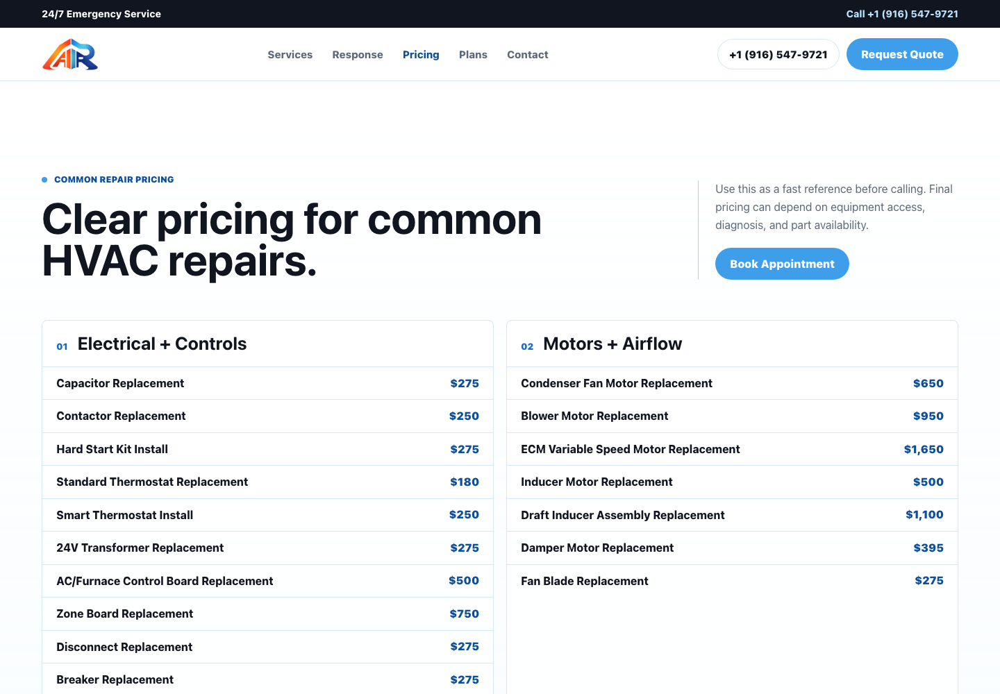
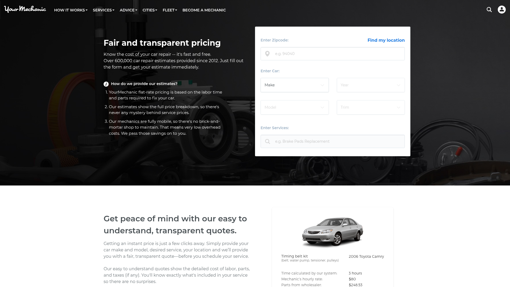
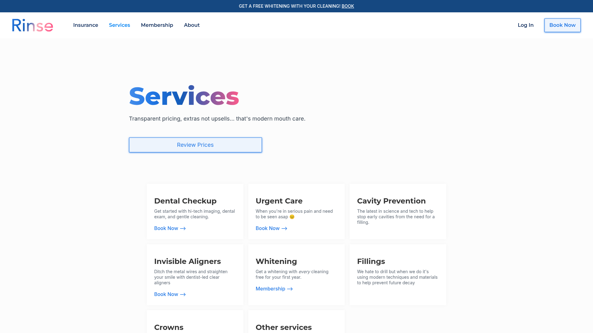
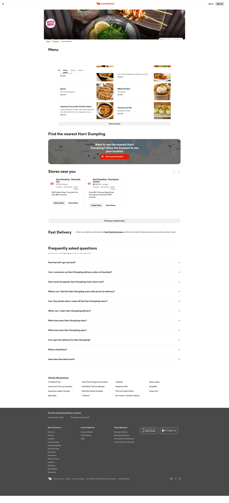
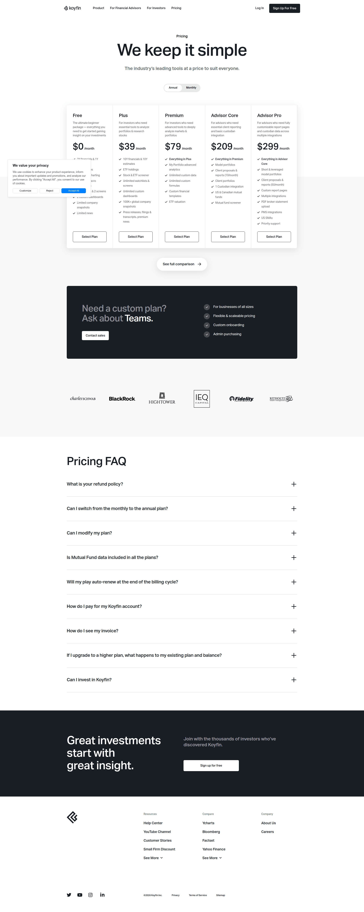

# Design Improvement: AR Air Pricing Page

## TL;DR
Turn the pricing page from a long price book into a guided price finder. Keep the transparent repair pricing, but add a search/filter entry point, common repair highlights, a sticky quote panel, and short trust copy that explains what affects final pricing.

## Current State

*The current page is clean and on-brand, but it asks visitors to scan six category cards and nearly fifty line items before they know what to do next.*

## Improvement Ideas

### 1. Add A Price Finder At The Top ⭐
Add a compact finder module above the full list: search input, category chips, and 4-6 "most common" repairs with prices. This keeps the honest price list but answers the customer’s first question faster: "How much might my repair cost?"

**Inspired by:**

*YourMechanic uses vehicle/search inputs and transparent quote framing to move users from pricing curiosity into booking. [Lazyweb]*


*Rinse presents transparent service prices as simple categorized cards with a clear review-prices action. [Lazyweb]*

**Why this works:** AR Air has enough prices that the page behaves like a catalog. A finder reduces scanning, supports customers who only know the symptom or part name, and gives the quote CTA a natural place to live.

**Sketch:**
```text
┌────────────────────────────────────────────────────────────┐
│ Common HVAC Repair Pricing                                 │
│ Search repair, symptom, or part...          [Search]       │
│ [Cooling] [Heating] [Electrical] [Motors] [Drainage]       │
│                                                            │
│ Popular repairs                                            │
│ ┌───────────────┐ ┌───────────────┐ ┌───────────────┐     │
│ │ Capacitor     │ │ Fan Motor     │ │ Drain Clearing │     │
│ │ $275          │ │ $650          │ │ $185           │     │
│ └───────────────┘ └───────────────┘ └───────────────┘     │
└────────────────────────────────────────────────────────────┘
```

### 2. Convert The List Into A Service Menu
Keep the six groups, but make navigation feel like a service menu: a sticky horizontal category bar on mobile and a small left rail on desktop. Clicking "Cooling + Refrigerant" or "Electrical + Controls" jumps directly to that category.

**Inspired by:**

*DoorDash uses persistent menu/category structure so long item lists stay navigable. [Lazyweb]*

**Why this works:** This page is closer to a restaurant/service menu than a SaaS pricing grid. Category navigation helps visitors browse the exact type of repair without feeling like everything is one giant table.

**Sketch:**
```text
┌────────────┬───────────────────────────────────────────────┐
│ Categories │ Electrical + Controls                         │
│ Cooling    │ Capacitor Replacement                  $275   │
│ Heating    │ Contactor Replacement                  $250   │
│ Motors     │ Hard Start Kit Install                 $275   │
│ Drainage   │ ...                                           │
└────────────┴───────────────────────────────────────────────┘
```

### 3. Add A Sticky "Not Sure What Failed?" Quote Panel
On desktop, place a sticky right-side panel beside the price book with phone/text/quote actions, same-day response copy, and a short explanation that final pricing depends on diagnosis, access, equipment, and part availability.

**Inspired by:**

*TaskRabbit pairs a service list with a persistent booking/help panel so the next action is always visible. [Lazyweb]*

**Why this works:** Customers often arrive stressed because the AC is down. The page should reassure them that they can call or text even if they do not know the part name.

**Sketch:**
```text
┌───────────────────────────────┬──────────────────────┐
│ Price categories and rows      │ Not sure what failed?│
│                               │ Call or text AR Air   │
│ Electrical + Controls          │ Same-day response     │
│ Motors + Airflow               │ [Call] [Text]         │
│ Heating Repairs                │ [Request Quote]       │
└───────────────────────────────┴──────────────────────┘
```

### 4. Add "How Pricing Works" And FAQ Below The List
Add a short trust section after the price book explaining diagnostic fees, emergency service, what can change a quote, and why compressor replacements require booking for price. Keep answers short and practical.

**Inspired by:**

*Koyfin combines pricing details with a structured FAQ so objections get answered before the visitor leaves. [Lazyweb]*

**Why this works:** The current note is helpful, but it is easy to miss. A dedicated FAQ can reduce price anxiety and explain edge cases without cluttering every row.

**Sketch:**
```text
┌────────────────────────────────────────────────────────────┐
│ How pricing works                                          │
│ ✓ Written estimate before work                             │
│ ✓ Final quote depends on diagnosis and access              │
│ ✓ 24/7 emergency service available                         │
│                                                            │
│ FAQ                                                        │
│ + Is the diagnostic included?                              │
│ + Why does compressor pricing require an appointment?      │
└────────────────────────────────────────────────────────────┘
```

### 5. Keep The Page Visual, But Use Equipment Sparingly
Add one small HVAC render or branded part visual near the finder, not behind the full price list. The current site has strong generated equipment assets, but the pricing page should stay utility-first.

**Inspired by:**

*AR Air already has a strong blue/white equipment-led style on the site. [Current design]*

**Why this works:** A subtle condenser/furnace visual keeps the page from feeling plain without fighting the price rows. Pricing pages convert through clarity first, polish second.

**Sketch:**
```text
┌───────────────────────────────┬──────────────────────────┐
│ Clear repair pricing           │ [small floating unit]    │
│ Search + category chips        │ 24/7 emergency service   │
│ [Book same-day diagnostic]     │                          │
└───────────────────────────────┴──────────────────────────┘
```

## What’s Working

- The page is already transparent. Showing real repair prices builds trust.
- The AR Air logo, cold blue palette, and white space match the current website direction.
- The six repair categories are sensible and map well to real HVAC customer needs.
- The phone, text, and quote actions are present and should be preserved.

## Research Notes

- Figma’s pricing-page guide emphasizes transparent pricing, strong CTAs, comparison/detail sections, mobile optimization, and FAQ content near the decision point. [Web](https://www.figma.com/resource-library/pricing-page-best-practices/)
- Baymard’s product-list research supports filters and clear category navigation for long browsable lists. That maps well to AR Air’s 49 repair rows. [Web](https://baymard.com/research/ecommerce-product-lists%20)
- Baymard’s filter UI guidance recommends category-specific filters and visible applied filters/chips, especially where lists are long. [Web](https://baymard.com/learn/ecommerce-filter-ui)
- GM EnerTech and Upton Air show that HVAC pricing pages often pair transparent prices with diagnostic/service-call explanations, written estimates, warranties, and FAQ-style reassurance. [GM EnerTech](https://gmenertech.com/pricing/service-pricing.html), [Upton Air](https://www.uptonhomeservices.com/service/hvac-repair/pricing/)
- `lazyweb_compare_image` failed against the current screenshot with an image embedding error, so this report uses Lazyweb text search plus downloaded references. No connected inspiration libraries were configured locally.

## All References

| Reference | Source | Why It Matters |
| --- | --- | --- |
| Current AR Air pricing page | Current | Shows the existing list-card structure and brand palette. |
| YourMechanic pricing | Lazyweb | Good pattern for turning pricing curiosity into a guided quote flow. |
| Rinse transparent service prices | Lazyweb | Clear service-price cards that feel trustworthy and quick to scan. |
| DoorDash menu categories | Lazyweb | Strong pattern for navigating long categorized lists. |
| TaskRabbit service list sidebar | Lazyweb | Persistent booking/help panel next to service options. |
| Koyfin pricing + FAQ | Lazyweb | Pricing details paired with comparison/FAQ reassurance. |
| Figma pricing best practices | Web | Pricing UX guidance for transparency, strong CTAs, and FAQ placement. |
| Baymard product list/filtering research | Web | Evidence for search, filtering, and category navigation on long lists. |
| GM EnerTech / Upton Air HVAC pricing pages | Web | HVAC-specific examples of transparent price framing and trust copy. |
